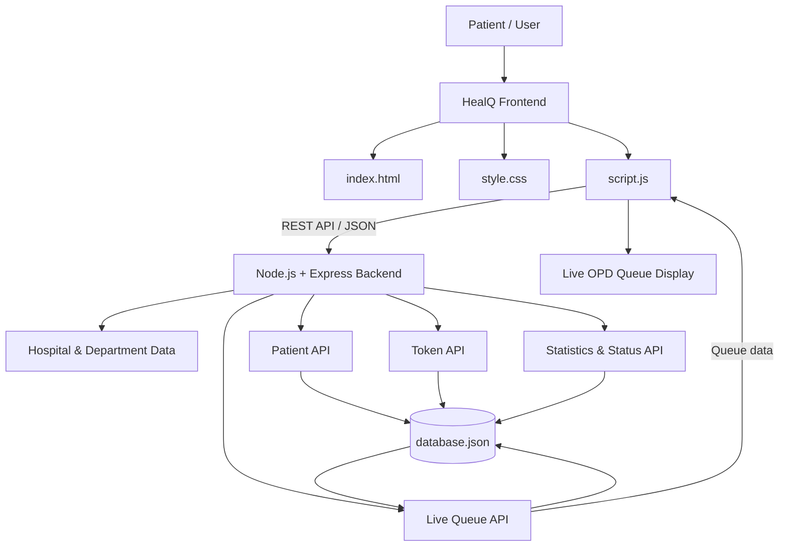
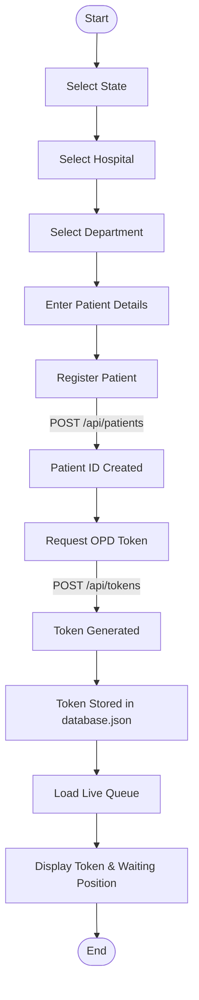
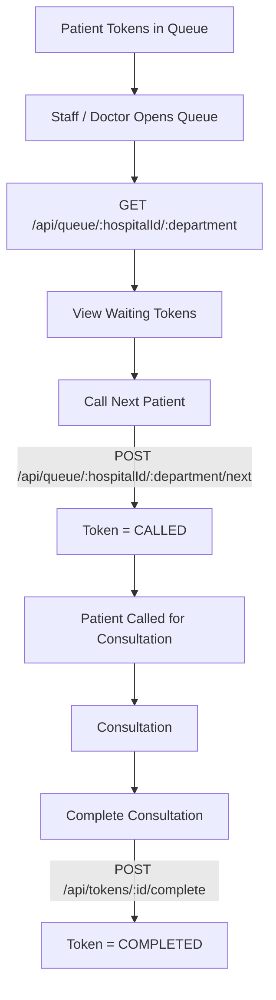

# HealQ
HealQ is an AI-powered Smart OPD Queue Management System that streamlines hospital visits through digital token booking, real-time queue tracking, appointment management, and intelligent patient assistance for faster, more efficient healthcare.
# HealQ — Smart OPD Queue & Hospital Access

> **A full-stack demonstration prototype for digital OPD registration, token generation and live queue visibility.**

HealQ is designed to reduce uncertainty and unnecessary waiting at hospital OPDs. The prototype allows a patient to select a **state, hospital and department**, enter basic patient details, register through the application and generate an OPD token. The frontend communicates with a **Node.js + Express REST API**, while demo patients and tokens are persisted in a local JSON data file.

**Project status:** Demo / academic / hackathon prototype  
**Data warning:** This project uses a local JSON file for demonstration. It is **not intended for real patient, medical or production healthcare data**.

---

## 1. Problem Statement

Hospital OPDs can become crowded because patients often have to:

- visit the hospital only to register for OPD;
- wait in long registration queues;
- manually check their token position;
- deal with uncertain waiting times;
- navigate different departments without a simple digital flow.

HealQ demonstrates how a digital OPD workflow can bring registration and queue information into one interface.

---

## 2. Proposed Solution

HealQ provides a simple digital workflow:

**Select location → Select hospital → Select department → Register patient → Generate token → Track queue**

The current prototype includes a frontend and a lightweight backend. Instead of keeping the complete demo state only in browser storage, important patient and token actions can be sent to the backend through REST APIs and stored in `backend/data/database.json`.

---

## 3. Key Features

### Patient-side features

- State and hospital selection
- Department selection
- Patient registration
- Optional ABHA ID field
- OPD token generation
- Token display
- Live queue information
- Queue refresh from backend
- Demo-friendly hospital and department data

### Backend features

- Node.js + Express REST API
- CORS support
- Patient registration endpoint
- Patient retrieval
- Hospital/state lookup
- Department lookup
- OPD token generation
- Live queue retrieval
- Token status management
- Call-next-patient workflow
- Consultation completion
- Queue statistics
- JSON-file persistence
- Demo data reset support

---

## 4. Technology Stack

| Layer | Technology | Purpose |
|---|---|---|
| Frontend | HTML5 | Page structure |
| Styling | CSS3 | UI, cards, forms and responsive layout |
| Client logic | JavaScript | User interaction and API communication |
| Backend | Node.js | Server runtime |
| API framework | Express.js | REST API and routing |
| Data format | JSON | API requests/responses and demo storage |
| Demo database | `database.json` | Persistent local demo data |
| Middleware | CORS | Frontend-backend communication |
| Development | VS Code | Development and testing |
| Version control | Git / GitHub | Project sharing and version control |

### Why JSON storage?

For a college/hackathon demonstration, JSON storage keeps the setup simple:

- no MongoDB installation;
- no database server required;
- no `.env` file required;
- data remains available after page refresh;
- easy to inspect during a demonstration.

For a production deployment, this should be replaced with a proper database such as PostgreSQL or MongoDB with authentication, access control, encryption and audit logging.

---

## 5. System Architecture



### Simple architecture view

```text
                 ┌─────────────────────┐
                 │   PATIENT / USER    │
                 └──────────┬──────────┘
                            │
                            ▼
                 ┌─────────────────────┐
                 │   HEALQ FRONTEND    │
                 │ HTML + CSS + JS     │
                 └──────────┬──────────┘
                            │
                       REST / JSON
                            │
                            ▼
                 ┌─────────────────────┐
                 │ NODE.JS + EXPRESS   │
                 │     BACKEND         │
                 └──────────┬──────────┘
                            │
                            ▼
                 ┌─────────────────────┐
                 │    database.json    │
                 │ Patients + Tokens   │
                 └──────────┬──────────┘
                            │
                            ▼
                 ┌─────────────────────┐
                 │  LIVE OPD QUEUE     │
                 └─────────────────────┘
```

---

## 6. Patient Journey



---

## 7. OPD Queue / Doctor Flow



---

## 8. Token Lifecycle

```text
WAITING
   │
   ▼
CALLED
   │
   ▼
IN_CONSULTATION
   │
   ▼
COMPLETED
```

A token can also be cancelled:

```text
WAITING ─────────► CANCELLED
```

The backend accepts these token states:

- `WAITING`
- `CALLED`
- `IN_CONSULTATION`
- `COMPLETED`
- `CANCELLED`

---

## 9. Backend API

Base URL:

```text
http://localhost:5000/api
```

### System

| Method | Endpoint | Purpose |
|---|---|---|
| GET | `/health` | Check server status |
| GET | `/` | Check backend |

### Hospitals

| Method | Endpoint | Purpose |
|---|---|---|
| GET | `/hospitals` | Get all hospitals |
| GET | `/hospitals/state/:state` | Get hospitals for a state |
| GET | `/hospitals/by-name/:name` | Find a hospital by name |
| GET | `/hospitals/:id/departments` | Get departments |

### Patients

| Method | Endpoint | Purpose |
|---|---|---|
| POST | `/patients` | Register a patient |
| GET | `/patients/:id` | Get a patient |

### Tokens

| Method | Endpoint | Purpose |
|---|---|---|
| POST | `/tokens` | Generate OPD token |
| GET | `/tokens` | Get tokens |
| GET | `/tokens/:id` | Get a token |
| PUT | `/tokens/:id/status` | Update token status |
| POST | `/tokens/:id/complete` | Complete consultation |

### Queue

| Method | Endpoint | Purpose |
|---|---|---|
| GET | `/queue/:hospitalId/:department` | Get live queue |
| POST | `/queue/:hospitalId/:department/next` | Call next waiting patient |

### Statistics

| Method | Endpoint | Purpose |
|---|---|---|
| GET | `/stats/:hospitalId/:department` | Get queue statistics |

---

## 10. Project Structure

```text
HealQ/
│
├── index.html
├── style.css
├── script.js
├── README.md
│
└── backend/
    ├── server.js
    ├── package.json
    │
    └── data/
        ├── database.json
        └── hospitals.js
```

### Main files

**`index.html`**  
Contains the HealQ interface and user-facing sections.

**`style.css`**  
Controls the visual design, forms, cards, buttons and responsive layout.

**`script.js`**  
Contains the frontend application logic and communicates with the backend using `fetch()`.

**`backend/server.js`**  
Runs the Express server and contains the REST API routes.

**`backend/data/database.json`**  
Stores demo patients and generated tokens.

**`backend/data/hospitals.js`**  
Contains the hospital/state data used by the backend.

---

## 11. Running HealQ in VS Code

### Requirements

Install:

1. **Node.js**
2. **Visual Studio Code**
3. A browser such as Chrome or Edge

No MongoDB is required.

No `.env` file is required.

### Step 1 — Open the project

Extract the ZIP and open the **HealQ folder** in VS Code.

### Step 2 — Open terminal

In VS Code:

```text
Terminal → New Terminal
```

### Step 3 — Enter backend folder

```bash
cd backend
```

### Step 4 — Install dependencies

```bash
npm install
```

### Step 5 — Start backend

```bash
npm start
```

Expected output:

```text
======================================
       HealQ Backend Server
======================================
Server: http://localhost:5000
Database: JSON file
Status: ONLINE
======================================
```

### Step 6 — Open the frontend

Open `index.html` using VS Code **Live Server**.

The frontend uses:

```text
http://localhost:5000/api
```

to communicate with the backend.

---

## 12. Testing the Backend

After starting the backend, open:

```text
http://localhost:5000
```

Expected response:

```json
{
  "success": true,
  "message": "HealQ Backend API is running",
  "version": "1.0.0"
}
```

Health check:

```text
http://localhost:5000/api/health
```

Hospital data:

```text
http://localhost:5000/api/hospitals
```

---

## 13. Example API Flow

### Register a patient

```http
POST /api/patients
Content-Type: application/json
```

Example body:

```json
{
  "name": "Demo Patient",
  "age": 21,
  "gender": "Female",
  "phone": "9000000000",
  "abhaId": "DEMO-ABHA",
  "email": "demo@example.com"
}
```

The backend returns a patient ID.

### Generate a token

```http
POST /api/tokens
Content-Type: application/json
```

Example:

```json
{
  "patientId": "P123456",
  "hospitalId": "hospital-id",
  "department": "GM"
}
```

The backend creates and stores the token.

### Get live queue

```http
GET /api/queue/:hospitalId/:department
```

The response contains:

- current token;
- waiting count;
- queue records;
- token status.

---

## 14. Demo Presentation Flow

For a hackathon or classroom demonstration, use this sequence:

```text
1. Open HealQ
        ↓
2. Select State
        ↓
3. Select Hospital
        ↓
4. Select OPD Department
        ↓
5. Enter patient details
        ↓
6. Register patient
        ↓
7. Generate OPD token
        ↓
8. Show token number
        ↓
9. Show live queue
        ↓
10. Demonstrate backend/API response
        ↓
11. Call next patient
        ↓
12. Complete consultation
```

This gives judges a complete **patient-to-queue workflow** instead of only showing a static UI.

---

## 15. Current Scope vs Production Scope

### Implemented in this prototype

- Digital patient registration
- Hospital selection
- Department selection
- OPD token generation
- Server-side demo persistence
- Live queue retrieval
- Token status workflow
- Basic queue statistics
- REST API integration

### Not a production healthcare system

The current project does **not** provide:

- real hospital integration;
- real ABHA verification;
- real patient medical records;
- secure user authentication;
- role-based hospital access control;
- encrypted medical-data storage;
- production-grade database;
- legally compliant health-data infrastructure;
- guaranteed real-time hospital queue synchronization.

These should be added before any real-world healthcare deployment.

---

## 16. Future Scope

HealQ can be extended into a broader hospital-access platform with:

### 🏥 Hospital Operations
- Bed availability
- Department capacity
- Doctor availability
- Staff management
- Hospital dashboard

### 🚑 Emergency Services
- Ambulance booking
- Emergency request management
- Hospital availability during emergencies

### 🧑‍💻 Patient Services
- Appointment scheduling
- Digital prescriptions
- Medical-record integration
- Notifications
- Queue-time estimation
- Multi-language interface
- Hospital kiosk for self-service OPD registration

### 🤖 AI / Smart Features
- AI-based symptom guidance
- Queue-time prediction
- Department recommendation
- Demand forecasting
- Hospital load analysis

### 🔐 Production Security
- Secure authentication
- Role-based access
- Database encryption
- Audit logs
- Secure API gateway
- Proper health-data compliance

---

## 17. Advantages

- Reduces dependency on physical OPD registration queues.
- Gives patients better visibility of their token status.
- Provides a simple digital patient journey.
- Uses a lightweight architecture suitable for demonstration.
- Separates frontend and backend responsibilities.
- Can be extended toward hospital operations and AI-based services.

---

## 18. Limitations

This is a **prototype**, not a deployed hospital information system.

The JSON database is intentionally used to make the project easy to run locally. It is not designed for concurrent hospital users, high availability, sensitive medical records or production security.

Hospital information in the prototype is demonstration data and should not be interpreted as a live hospital availability service.

---

## 19. Conclusion

HealQ demonstrates how a digital OPD workflow can connect **patient registration, token generation and queue visibility** through a simple web application and REST backend.

The current architecture provides a foundation that can later be upgraded to a production database, authentication system, hospital integrations, notifications, AI-assisted services and additional hospital-management modules.

**HealQ's core objective:**  
> **Make OPD access simpler, more transparent and less time-consuming for patients.**

---

## 20. Author / Project Information

**Project:** HealQ — Smart OPD Queue & Hospital Access  
**Type:** Academic / Hackathon Demonstration Prototype  
**Frontend:** HTML, CSS, JavaScript  
**Backend:** Node.js, Express.js  
**Storage:** JSON demo database  
**Development:** Visual Studio Code

---

## License

This project is intended for educational and demonstration purposes. Add an appropriate open-source license before public redistribution.

